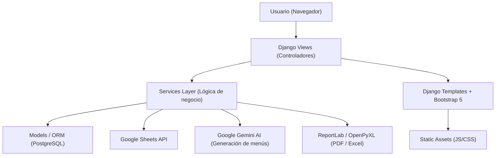

# PRD — ERP CHVS (Sistema ERP para Operadores del PAE)

**Versión:** 1.0  
**Fecha:** Febrero 2026  
**Estado:** Draft  
**Autor:** Equipo CHVS

---

## 1. Resumen Ejecutivo

ERP_CHVS es un sistema de planificación de recursos empresariales diseñado específicamente para operadores del **Programa de Alimentación Escolar (PAE)** en Colombia. Su propósito es automatizar, centralizar y auditar los procesos críticos del programa: la gestión de beneficiarios (focalización), el análisis nutricional de menús, la planeación operativa y la generación de reportes para entes de control.

El sistema resuelve un problema de alto impacto: la operación manual del PAE involucra miles de registros de beneficiarios escolares, validaciones normativas complejas y múltiples sedes educativas, lo que genera errores, reprocesos y riesgos de incumplimiento contractual.

---

## 2. Contexto y Problema

### 2.1 Contexto Operativo

Los operadores del PAE deben:
- **Focalizar** listados de beneficiarios por institución y nivel escolar, cruzando bases de datos de múltiples formatos Excel con registros oficiales.
- **Cumplir normativas nutricionales** (Resolución UAPA, ICBF) que regulan gramajes, frecuencias de componentes y aportes nutricionales por modalidad y nivel escolar.
- **Planear** la entrega de alimentos por fecha, sede y ruta de distribución.
- **Reportar** a entidades de gobierno con documentos PDF/Excel auditables.

### 2.2 Problema Central

Sin un sistema unificado, los equipos operan con hojas de cálculo desconectadas, lo que provoca:
- Doble captura de información y errores humanos en datos de beneficiarios.
- Incumplimiento nutricional no detectado hasta supervisiones externas.
- Órdenes de compra calculadas manualmente con riesgo de sobrestock o déficit.
- Trazabilidad insuficiente para auditorías contractuales.

### 2.3 Alcance Geográfico

El sistema opera actualmente en:
- **Cali** (Google Sheet ID principal: `GOOGLE_SHEET_ID`)
- **Yumbo** (Google Sheet ID secundario: `GOOGLE_SHEET_ID_YUMBO`)

---

## 3. Usuarios Objetivo

| Rol | Responsabilidades en el sistema |
|---|---|
| **Nutricionista** | Crear y analizar menús, validar cumplimiento UAPA/ICBF, aprobar análisis nutricionales, hacer match ICBF→Compras |
| **Operador de Focalización** | Cargar y validar listados Excel de beneficiarios escolares, gestionar sedes educativas |
| **Coordinador de Planeación** | Programar menús por sede y fecha, gestionar rutas de entrega, generar órdenes de compra |
| **Administrador del Sistema** | Gestionar usuarios, contratos/programas, parámetros maestros |
| **Auditor / Supervisión** | Consultar reportes PDF/Excel históricos para entes de control |

---

## 4. Módulos del Sistema

### 4.1 Módulo: Focalización (`facturacion/`)

**Objetivo:** Ingestar, validar y persistir los listados de beneficiarios PAE provenientes de archivos Excel del SIMAT.

#### Funcionalidades

| ID | Funcionalidad | Descripción |
|---|---|---|
| FAC-01 | Carga de listados Excel | Soporte para formatos "Original" y "Lote 3" del SIMAT; validación de estructura de columnas |
| FAC-02 | Validación de sedes educativas | Coincidencia difusa (fuzzy matching) entre nombres de sedes del Excel y el catálogo oficial |
| FAC-03 | Normalización de datos | Estandarización de municipios (ej. "BUGA" → "GUADALAJARA DE BUGA"), géneros, fechas |
| FAC-04 | Vista previa de dos etapas | El operador revisa el resultado procesado antes de confirmar guardado en base de datos |
| FAC-05 | Persistencia masiva | Inserción por `bulk_create` con fallback unitario; manejo de transacciones atómicas |
| FAC-06 | Generación de reportes PDF | Planillas de asistencia por institución con firma del profesional, ítem de focalización embebido |
| FAC-07 | Integración Google Sheets | Sincronización bidireccional con hojas de cálculo por sede (`CALI` / `YUMBO`) |
| FAC-08 | Gestión de listados | Consulta, filtro y eliminación de listados ya procesados |

#### Reglas de Negocio
- Una sede educativa con diferencia tipográfica menor (umbral configurable) se acepta mediante fuzzy matching.
- El listado no se persiste hasta confirmación explícita del usuario (flujo de dos etapas).
- Cada registro almacena la sede educativa con su `item` numérico de focalización.

---

### 4.2 Módulo: Nutrición (`nutricion/`)

**Objetivo:** Diseñar menús cíclicos (1–20), calcular su aporte nutricional y validar el cumplimiento de la Resolución UAPA del ICBF.

#### Funcionalidades

| ID | Funcionalidad | Descripción |
|---|---|---|
| NUT-01 | Catálogo de alimentos ICBF 2018 | Tabla con composición nutricional de más de 1,000 alimentos; base de referencia de los menús |
| NUT-02 | Gestión de menús (1–20) | Editor de preparaciones e ingredientes con gramajes; menús agrupados en 4 semanas |
| NUT-03 | Análisis nutricional | Cálculo automático de Energía, Proteínas, Grasas, CHO, Calcio, Hierro, Sodio por menú y nivel escolar |
| NUT-04 | Semaforización nutricional | Indicador visual (verde/amarillo/rojo) de adecuación porcentual por nutriente |
| NUT-05 | Validador semanal | Agrupa 20 menús en 4 semanas y valida la frecuencia de componentes según resolución |
| NUT-06 | Generación de menús con IA | Integración con Google Gemini Pro para generar menús que cumplan metas nutricionales específicas |
| NUT-07 | Exportación Excel | Planilla maestra de menús e informe de guías de preparación por modalidad |
| NUT-08 | Exportación PDF | Análisis nutricional firmado digitalmente por el dietista elaborador y aprobador |
| NUT-09 | Match ICBF → Compras | Equivalencia entre alimento ICBF y producto de compras (Siesa) por programa/contrato |
| NUT-10 | Gestión de firmas nutricionales | Carga y optimización de firmas por programa; usadas en PDFs y Excel oficiales |

#### Reglas de Negocio
- La adecuación nutricional se evalúa: 0–35% Óptimo (verde), 35.1–70% Aceptable (amarillo), >70% Alto (rojo).
- Un menú cíclico cubre 4 semanas × 5 días = 20 menús.
- Los requerimientos nutricionales varían por **nivel escolar** (Preescolar, Básica Primaria, Secundaria) y **modalidad de consumo** (CAP AM, Almuerzo, JT, etc.).
- El match ICBF→Compras es único por par [(alimento ICBF, programa)](file:///c:/Users/User/OneDrive/Desktop/CHVS/ERP_CHVS/erp_chvs/nutricion/models.py#1010-1020), lo que permite diferenciarlo por contrato/sede.

---

### 4.3 Módulo: Planeación (`planeacion/`)

**Objetivo:** Programar la entrega de menús por sede y fecha, gestionar rutas de distribución y calcular las necesidades de compra.

#### Funcionalidades

| ID | Funcionalidad | Descripción |
|---|---|---|
| PLA-01 | Catálogo de sedes educativas | Gestión de sedes con municipio, institución, nivel escolar, raciones contratadas |
| PLA-02 | Catálogo de instituciones | Gestión de instituciones educativas que agrupan sedes |
| PLA-03 | Gestión de programas/contratos | Creación y gestión de contratos PAE con sus parámetros operativos |
| PLA-04 | Planificación de raciones | Configuración de raciones por sede, nivel escolar y año escolar |
| PLA-05 | Programación diaria de menús | Asignar menú + programa + modalidad por sede y fecha; estados: Programado/Entregado/Cancelado |
| PLA-06 | Cálculo de necesidades de compra | Fórmula: `raciones × gramaje ICBF ÷ contenido_gramos_Siesa = unidades a comprar` |
| PLA-07 | Generación de orden de compra | Exportación PDF/Excel de insumos necesarios para un rango de fechas |
| PLA-08 | Gestión de rutas de entrega | Definición de rutas por programa; asignación de sedes con orden de visita |
| PLA-09 | Planilla de entrega por ruta | Reporte en orden de recorrido para el transportador |
| PLA-10 | Alertas de match faltante | Notificación cuando un menú programado tiene ingredientes sin equivalencia en Siesa |

#### Reglas de Negocio
- Un menú puede programarse sin ruta asignada (la ruta es opcional en fase inicial).
- La clave de programación es única por [(sede, fecha, programa, modalidad)](file:///c:/Users/User/OneDrive/Desktop/CHVS/ERP_CHVS/erp_chvs/nutricion/models.py#1010-1020).
- Las rutas son propias de cada programa/contrato (no se comparten).
- Una sede puede pertenecer a múltiples rutas si se entregan modalidades distintas por recorridos separados.

---

### 4.4 Módulo: Costos (`costos/`)

**Objetivo:** Análisis y seguimiento de costos operativos del programa.

> **Estado:** Módulo en desarrollo inicial. Las funcionalidades se definirán en iteraciones futuras.

---

### 4.5 Módulo: Principal / Dashboard (`dashboard/`, `principal/`)

**Objetivo:** Punto de entrada del sistema; gestión de usuarios, parámetros maestros y estadísticas globales.

#### Funcionalidades

| ID | Funcionalidad | Descripción |
|---|---|---|
| DAS-01 | Autenticación y sesión | Login/logout con redirección a página de inicio; gestión de sesión segura |
| DAS-02 | Control de acceso por rol | Permisos granulares por módulo (ej. `view_contenido_nutricion`) |
| DAS-03 | Catálogos maestros | Municipios, departamentos, modalidades de consumo, grados escolares UAPA |
| DAS-04 | Dashboard de KPIs | Estadísticas de beneficiarios, cobertura por sede, cumplimiento nutricional |
| DAS-05 | API REST interna | Endpoints JSON para operaciones AJAX del frontend (`/api/`) |

---

## 5. Requisitos No Funcionales

### 5.1 Rendimiento
- Procesamiento de archivos Excel con hasta **5,000 registros** en menos de 30 segundos.
- Inserción masiva via `bulk_create` para operaciones de alto volumen.
- Índices de base de datos en campos de búsqueda frecuente (`fecha`, `id_programa`, `sede_educativa`).

### 5.2 Seguridad
- Autenticación Django nativa con CSRF protection.
- Variables sensibles (GOOGLE_SHEET_ID, claves de API) en archivo [.env](file:///c:/Users/User/OneDrive/Desktop/CHVS/ERP_CHVS/erp_chvs/.env), nunca en el código.
- Permisos por módulo; el acceso a nutrición requiere permiso explícito `view_contenido_nutricion`.

### 5.3 Disponibilidad y Operación
- Zona horaria: `America/Bogota`. `USE_TZ = True`.
- Servidor de desarrollo: `python manage.py runserver` en puerto 8000.
- Base de datos: PostgreSQL con `psycopg2-binary`.

### 5.4 Usabilidad
- Interfaz web responsiva con **Bootstrap 5**.
- Tablas interactivas con **DataTables** (paginación, búsqueda, ordenamiento).
- Alertas y confirmaciones con **SweetAlert2**.
- Idioma de interfaz: **Español**.

### 5.5 Mantenibilidad
- **Arquitectura orientada a servicios (SOA):** la lógica de negocio reside en [services.py](file:///c:/Users/User/OneDrive/Desktop/CHVS/ERP_CHVS/erp_chvs/planeacion/services.py); las vistas solo orquestan.
- **Convenciones de código:** PEP 8, comentarios en español, nombres de clases en inglés (PascalCase).
- Separación en capas: Modelos → Servicios → Vistas → Templates.

---

## 6. Arquitectura Técnica



### Stack Tecnológico

| Capa | Tecnología |
|---|---|
| Backend | Python 3.13+, Django 5.2.5 |
| Base de datos | PostgreSQL + psycopg2-binary |
| Procesamiento de datos | Pandas, NumPy, OpenPyXL |
| Inteligencia artificial | Google Generative AI (Gemini Pro) |
| Exportación | ReportLab (PDF), OpenPyXL (Excel) |
| Frontend | Bootstrap 5, jQuery, DataTables, SweetAlert2 |
| Fuzzy Matching | fuzzywuzzy, RapidFuzz |
| Testing | Pytest, Django Test Runner |

---

## 7. Flujos de Proceso Clave

### 7.1 Flujo: Proceso de Focalización

```
1. Operador carga archivo Excel (formato Original o Lote 3)
2. Sistema valida estructura y columnas requeridas
3. Sistema normaliza datos (municipios, géneros, fechas)
4. Fuzzy matching: valida/corrige nombres de sedes educativas
5. Vista previa: operador revisa y aprueba o corrige
6. Sistema persiste registros via bulk_create en PostgreSQL
7. Sistema sincroniza datos con Google Sheets (Cali/Yumbo)
8. Generación de planilla PDF de asistencia
```

### 7.2 Flujo: Análisis Nutricional de Menú

```
1. Nutricionista selecciona el menú (1–20) y modalidad de consumo
2. Sistema agrupa preparaciones e ingredientes del menú
3. Sistema calcula totales nutricionales cruzando con TCAC ICBF 2018
4. Sistema evalúa adecuación por nivel escolar vs. Resolución UAPA
5. Semaforización: verde/amarillo/rojo por nutriente
6. Validador semanal verifica frecuencias de componentes en 4 semanas
7. Nutricionista genera PDF/Excel firmado para archivo oficial
```

### 7.3 Flujo: Planeación y Orden de Compra

```
1. Nutricionista configura match ICBF → Siesa por programa
2. Coordinador programa menús por sede, fecha, modalidad y raciones
3. Sistema detecta ingredientes sin match y emite alertas
4. Sistema calcula: raciones × gramaje ÷ contenido_Siesa = unidades
5. Coordinador genera reporte de orden de compra por periodo
6. Sistema agrupa la orden por ruta de entrega
```

---

## 8. Modelo de Datos (Tablas Principales)

| Tabla (db_table) | Módulo | Descripción |
|---|---|---|
| `listados_focalizacion` | facturación | Beneficiarios PAE procesados |
| `sedes_educativas` | planeación | Catálogo de sedes con `item` numérico |
| `instituciones_educativas` | planeación | Agrupador de sedes |
| `planificacion_raciones` | planeación | Raciones por sede/nivel/año |
| `programa_modalidades` | planeación | Modalidades por programa/contrato |
| `nutricion_tabla_alimentos_2018_icb` | nutrición | Tabla TCAC ICBF 2018 (>1,000 alimentos) |
| `nutricion_tabla_menus` | nutrición | Catálogo de menús (1–20) |
| `nutricion_tabla_preparaciones` | nutrición | Preparaciones por menú |
| `nutricion_tabla_preparacion_ingredientes` | nutrición | Ingredientes + gramajes por preparación |
| `nutricion_total_aporte_promedio_diario` | nutrición | Requerimientos nutricionales UAPA |
| `nutricion_adecuacion_total_porc` | nutrición | Porcentajes de adecuación calculados |
| `nutricion_firma_nutricional_contrato` | nutrición | Firmas digitales por programa |
| `tabla_ingredientes_siesa` | nutrición | Catálogo de compras/inventario Siesa |
| `nutricion_equivalencia_icbf_compras` | nutrición | Match ICBF → Siesa por programa *(PENDIENTE)* |
| `planeacion_programacion_menus` | planeación | Programación diaria de menús *(PENDIENTE)* |
| `planeacion_rutas` | planeación | Rutas de entrega por programa *(PENDIENTE)* |
| `planeacion_ruta_sedes` | planeación | Sedes por ruta con orden de visita *(PENDIENTE)* |

---

## 9. Roadmap de Implementación

### Fase 1 — Fundamentos (Completado ✅)
- [x] Módulo de Focalización con SOA completa
- [x] Tabla TCAC ICBF 2018
- [x] Motor de análisis nutricional con semaforización
- [x] Exportación PDF/Excel de análisis nutricionales
- [x] Soporte multi-sede (Cali / Yumbo)
- [x] Validador semanal de frecuencias de componentes

### Fase 2 — Match ICBF → Compras (En Progreso 🔄)
- [ ] Ampliar [TablaIngredientesSiesa](file:///c:/Users/User/OneDrive/Desktop/CHVS/ERP_CHVS/erp_chvs/nutricion/models.py#436-459) con `presentacion`, `unidad_medida`, `contenido_gramos`
- [ ] Crear modelo `EquivalenciaICBFCompras`
- [ ] UI de match: nutricionista asigna producto Siesa por programa
- [ ] Semáforo de ingredientes con/sin match en el editor de menús

### Fase 3 — Programación de Menús y Compras
- [ ] Crear modelo `ProgramacionMenus` (sede + fecha + menú + programa + modalidad)
- [ ] Vista de programación diaria con calendario
- [ ] Servicio de cálculo de necesidades de compra
- [ ] Exportación de orden de compra (PDF/Excel)

### Fase 4 — Rutas de Entrega
- [ ] Crear modelos `Ruta` y `RutaSedes`
- [ ] UI para gestionar rutas y asignar sedes con orden de visita
- [ ] Planilla de entrega ordenada por ruta

### Fase 5 — Costos y Reportes Avanzados
- [ ] Módulo de costos: presupuesto vs. ejecución real
- [ ] Dashboard de KPIs operativos y nutricionales
- [ ] Integración con sistema Siesa (API o importación Excel)

---

## 10. Criterios de Aceptación por Módulo

### Focalización
- [ ] El sistema procesa archivos Excel de hasta 5,000 registros sin errores.
- [ ] El fuzzy matching identifica correctamente ≥95% de las sedes con variaciones tipográficas menores.
- [ ] El PDF generado cumple con el formato oficial de planilla de asistencia PAE.

### Nutrición
- [ ] El cálculo nutricional por menú coincide con los valores de la TCAC ICBF 2018.
- [ ] El validador semanal detecta incumplimientos de frecuencia de componentes según la Resolución UAPA.
- [ ] La IA genera menús con adecuación nutricional ≥85% en todos los macronutrientes.

### Planeación
- [ ] El sistema calcula las unidades de compra con precisión de 2 decimales.
- [ ] Los menús programados con ingredientes sin match muestran alerta prominente al coordinador.
- [ ] La planilla de entrega respeta el orden de visita configurado en la ruta.

---

## 11. Métricas de Éxito

| Métrica | Objetivo |
|---|---|
| Tiempo de procesamiento de listado Excel | < 30 segundos para 5,000 registros |
| Tasa de coincidencia de sedes (fuzzy) | ≥ 95% sin intervención manual |
| Reducción de errores en focalización | ≥ 80% vs. proceso manual |
| Tiempo de generación de análisis nutricional | < 5 segundos por menú |
| Cobertura de match ICBF→Compras por programa | 100% antes de programar menús |
| Tiempo de generación de orden de compra | < 10 segundos para 30 días |

---

## 12. Restricciones y Supuestos

### Restricciones
- El sistema opera bajo **regulación colombiana** (PAE, ICBF, Resolución UAPA).
- Los datos de focalización son **sensibles** (datos de menores de edad; cumplimiento de Ley 1581/2012 – Habeas Data).
- La tabla TCAC ICBF 2018 es de **solo lectura**; no puede modificarse sin validación del nutricionista.

### Supuestos
- Los operadores tienen acceso a internet para la integración con Google Sheets.
- El sistema Siesa proporciona el catálogo de ingredientes en formato Excel importable.
- Un único servidor PostgreSQL centraliza todos los datos de ambas sedes (Cali y Yumbo).

---

*Documento generado el 24 de febrero de 2026. Versión sujeta a revisión con el equipo operativo de CHVS.*
