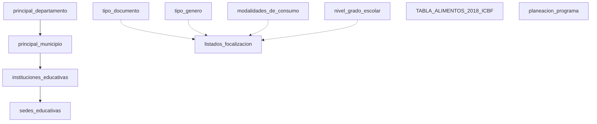

# ERP CHVS - Sistema de Gestión Integral

## Descripción General

ERP CHVS es un sistema integral de gestión desarrollado en Django para la administración del Programa Alimentario Escolar (PAE). El sistema está diseñado modularmente para manejar diferentes aspectos del programa: facturación, planeación, nutrición y administración principal.

## Arquitectura del Sistema

### Módulos Principales

- **👑 Principal**: Gestión de datos maestros (departamentos, municipios, tipos de documento, géneros)
- **📊 Planeación**: Administración de instituciones, sedes educativas y programas
- **🍎 Nutrición**: Gestión de información nutricional y tabla de alimentos ICBF
- **💰 Facturación**: Procesamiento de archivos Excel y generación de listados
- **📈 Dashboard**: Panel principal de administración

---

## 📋 Base de Datos - Tablas y Modelos

### 🏛️ **MÓDULO PRINCIPAL**

#### 1. **principal_departamento**
Tabla maestra de departamentos de Colombia.

| Campo | Tipo | Restricciones | Descripción |
|-------|------|---------------|-------------|
| `codigo_departamento` | VARCHAR(100) | PK, NOT NULL | Código único del departamento |
| `nombre_departamento` | VARCHAR(100) | NOT NULL | Nombre del departamento |

**Modelo Django:** `PrincipalDepartamento`

---

#### 2. **principal_municipio**
Tabla maestra de municipios de Colombia.

| Campo | Tipo | Restricciones | Descripción |
|-------|------|---------------|-------------|
| `id` | BIGINT | PK, AUTO_INCREMENT | ID único auto-generado |
| `codigo_municipio` | INTEGER | NOT NULL | Código DANE del municipio |
| `nombre_municipio` | VARCHAR(100) | NOT NULL | Nombre del municipio |
| `codigo_departamento` | VARCHAR(100) | NOT NULL | Código del departamento |

**Modelo Django:** `PrincipalMunicipio`

---

#### 3. **tipo_documento**
Catálogo de tipos de documento de identidad.

| Campo | Tipo | Restricciones | Descripción |
|-------|------|---------------|-------------|
| `id_documento` | VARCHAR(10) | PK, NOT NULL, UNIQUE | ID único del tipo de documento |
| `tipo_documento` | VARCHAR(100) | NOT NULL | Nombre del tipo de documento |
| `codigo_documento` | INTEGER | NOT NULL | Código numérico del documento |

**Modelo Django:** `TipoDocumento`

**Ejemplos:** CC (Cédula de Ciudadanía), TI (Tarjeta de Identidad), RC (Registro Civil)

---

#### 4. **tipo_genero**
Catálogo de géneros.

| Campo | Tipo | Restricciones | Descripción |
|-------|------|---------------|-------------|
| `id_genero` | VARCHAR(10) | PK, NOT NULL, UNIQUE | ID único del género |
| `genero` | VARCHAR(50) | NOT NULL | Descripción del género |
| `codigo_genero` | INTEGER | NOT NULL | Código numérico del género |

**Modelo Django:** `TipoGenero`

**Ejemplos:** Masculino, Femenino, Otro

---

#### 5. **modalidades_de_consumo**
Catálogo de modalidades de consumo alimentario.

| Campo | Tipo | Restricciones | Descripción |
|-------|------|---------------|-------------|
| `id_modalidades` | VARCHAR(10) | PK, NOT NULL, UNIQUE | ID único de la modalidad |
| `modalidad` | VARCHAR(150) | NOT NULL | Descripción de la modalidad |
| `cod_modalidad` | VARCHAR(20) | NOT NULL | Código de la modalidad |

**Modelo Django:** `ModalidadesDeConsumo`

**Ejemplos:** Preparado en sitio, Industrializado, Olla comunitaria

---

#### 6. **nivel_grado_escolar**
Catálogo de niveles y grados escolares.

| Campo | Tipo | Restricciones | Descripción |
|-------|------|---------------|-------------|
| `id_grado_escolar` | VARCHAR(50) | PK, NOT NULL, UNIQUE | ID único del grado |
| `grados_sedes` | VARCHAR(200) | NOT NULL | Descripción de grados |
| `nivel_escolar_uapa` | VARCHAR(100) | NOT NULL | Nivel escolar UAPA |

**Modelo Django:** `NivelGradoEscolar`

**Ejemplos:** Preescolar, Primaria 1-2, Primaria 3-4-5, Secundaria, Media

---

### 🏫 **MÓDULO PLANEACIÓN**

#### 7. **instituciones_educativas**
Registro de instituciones educativas.

| Campo | Tipo | Restricciones | Descripción |
|-------|------|---------------|-------------|
| `codigo_ie` | VARCHAR(50) | PK, NOT NULL, UNIQUE | Código único de la institución |
| `nombre_institucion` | VARCHAR(255) | NOT NULL | Nombre de la institución educativa |
| `id_municipios` | BIGINT | FK, NOT NULL | Referencia a municipio |

**Modelo Django:** `InstitucionesEducativas`

**Relaciones:**
- `id_municipios` → `principal_municipio.id`

---

#### 8. **sedes_educativas**
Registro de sedes educativas por institución.

| Campo | Tipo | Restricciones | Descripción |
|-------|------|---------------|-------------|
| `cod_interprise` | VARCHAR(50) | PK, NOT NULL, UNIQUE | Código único de la sede |
| `cod_dane` | VARCHAR(50) | NOT NULL | Código DANE de la sede |
| `nombre_sede_educativa` | VARCHAR(255) | NOT NULL | Nombre de la sede |
| `nombre_generico_sede` | VARCHAR(255) | DEFAULT 'Sin especificar' | Nombre genérico |
| `zona` | VARCHAR(1) | NOT NULL | Zona (U=Urbana, R=Rural) |
| `direccion` | VARCHAR(255) | NULLABLE | Dirección de la sede |
| `preparado` | VARCHAR(50) | NOT NULL | Modalidad preparado |
| `industrializado` | VARCHAR(50) | NOT NULL | Modalidad industrializado |
| `codigo_ie` | VARCHAR(50) | FK, NOT NULL | Referencia a institución |

**Modelo Django:** `SedesEducativas`

**Relaciones:**
- `codigo_ie` → `instituciones_educativas.codigo_ie`

---

#### 9. **planeacion_programa**
Registro de programas de alimentación escolar.

| Campo | Tipo | Restricciones | Descripción |
|-------|------|---------------|-------------|
| `id` | BIGINT | PK, AUTO_INCREMENT | ID único auto-generado |
| `programa` | VARCHAR(200) | NOT NULL | Nombre del programa |
| `fecha_inicial` | DATE | NOT NULL | Fecha de inicio |
| `fecha_final` | DATE | NOT NULL | Fecha de finalización |
| `estado` | VARCHAR(8) | DEFAULT 'activo' | Estado (activo/inactivo) |
| `imagen` | VARCHAR(100) | NULLABLE | Ruta de imagen |
| `contrato` | VARCHAR(100) | DEFAULT 'SIN_CONTRATO' | Número de contrato |

**Modelo Django:** `Programa`

**Opciones de Estado:** 'activo', 'inactivo'

---

### 🍎 **MÓDULO NUTRICIÓN**

#### 10. **TABLA_ALIMENTOS_2018_ICBF**
Tabla nutricional de alimentos basada en datos del ICBF 2018.

| Campo | Tipo | Restricciones | Descripción |
|-------|------|---------------|-------------|
| `codigo` | VARCHAR(20) | PK, NOT NULL | Código único del alimento |
| `nombre_del_alimento` | VARCHAR(200) | NOT NULL | Nombre del alimento |
| `parte_analizada` | VARCHAR(100) | NULLABLE | Parte del alimento analizada |
| `humedad_g` | DECIMAL(10,2) | NOT NULL | Humedad en gramos |
| `energia_kcal` | INTEGER | NOT NULL | Energía en kilocalorías |
| `energia_kj` | INTEGER | NOT NULL | Energía en kilojoules |
| `proteina_g` | DECIMAL(10,2) | NOT NULL | Proteína en gramos |
| `lipidos_g` | DECIMAL(10,2) | NOT NULL | Lípidos en gramos |
| `carbohidratos_totales_g` | DECIMAL(10,2) | NOT NULL | Carbohidratos totales |
| `carbohidratos_disponibles_g` | DECIMAL(10,2) | NULLABLE | Carbohidratos disponibles |
| `fibra_dietaria_g` | DECIMAL(10,2) | NULLABLE | Fibra dietaria |
| `cenizas_g` | DECIMAL(10,2) | NULLABLE | Cenizas |
| `calcio_mg` | INTEGER | NULLABLE | Calcio en miligramos |
| `hierro_mg` | DECIMAL(10,2) | NULLABLE | Hierro en miligramos |
| `sodio_mg` | INTEGER | NULLABLE | Sodio en miligramos |
| `fosforo_mg` | INTEGER | NULLABLE | Fósforo en miligramos |
| `yodo_mg` | DECIMAL(10,2) | NULLABLE | Yodo en miligramos |
| `zinc_mg` | DECIMAL(10,2) | NULLABLE | Zinc en miligramos |
| `magnesio_mg` | INTEGER | NULLABLE | Magnesio en miligramos |
| `potasio_mg` | INTEGER | NULLABLE | Potasio en miligramos |
| `tiamina_mg` | DECIMAL(10,2) | NULLABLE | Tiamina (B1) |
| `riboflavina_mg` | DECIMAL(10,2) | NULLABLE | Riboflavina (B2) |
| `niacina_mg` | DECIMAL(10,2) | NULLABLE | Niacina (B3) |
| `folatos_mcg` | DECIMAL(10,2) | NULLABLE | Folatos en microgramos |
| `vitamina_b12_mcg` | DECIMAL(10,2) | NULLABLE | Vitamina B12 |
| `vitamina_c_mg` | INTEGER | NULLABLE | Vitamina C |
| `vitamina_a_er` | INTEGER | NULLABLE | Vitamina A (equivalentes retinol) |
| `grasa_saturada_g` | DECIMAL(10,2) | NULLABLE | Grasa saturada |
| `grasa_monoinsaturada_g` | DECIMAL(10,2) | NULLABLE | Grasa monoinsaturada |
| `grasa_poliinsaturada_g` | DECIMAL(10,2) | NULLABLE | Grasa poliinsaturada |
| `colesterol_mg` | INTEGER | NULLABLE | Colesterol |
| `parte_comestible_porcentaje` | INTEGER | NULLABLE | % parte comestible |

**Modelo Django:** `TablaAlimentos2018Icbf`

---

### 💰 **MÓDULO FACTURACIÓN**

#### 11. **listados_focalizacion**
Tabla para almacenar listados procesados del PAE.

| Campo | Tipo | Restricciones | Descripción |
|-------|------|---------------|-------------|
| `id_listados` | VARCHAR(50) | PK, NOT NULL, UNIQUE | ID único del listado |
| `ano` | INTEGER | NOT NULL, >= 2020 | Año del registro |
| `etc` | VARCHAR(100) | NOT NULL | Entidad Territorial Certificada |
| `institucion` | VARCHAR(200) | NOT NULL | Institución Educativa |
| `sede` | VARCHAR(200) | NOT NULL | Sede Educativa |
| `tipodoc` | VARCHAR(10) | NOT NULL | Tipo de Documento |
| `doc` | VARCHAR(20) | NOT NULL | Número de Documento |
| `apellido1` | VARCHAR(100) | NULLABLE | Primer Apellido |
| `apellido2` | VARCHAR(100) | NULLABLE | Segundo Apellido |
| `nombre1` | VARCHAR(100) | NOT NULL | Primer Nombre |
| `nombre2` | VARCHAR(100) | NULLABLE | Segundo Nombre |
| `fecha_nacimiento` | VARCHAR(20) | NOT NULL | Fecha de Nacimiento |
| `edad` | INTEGER | NOT NULL, >= 0 | Edad calculada |
| `etnia` | VARCHAR(50) | NULLABLE | Etnia |
| `genero` | VARCHAR(10) | NOT NULL | Género |
| `grado_grupos` | VARCHAR(20) | NOT NULL | Grado y Grupos |
| `complemento_alimentario_preparado_am` | VARCHAR(10) | NULLABLE | Complemento AM |
| `complemento_alimentario_preparado_pm` | VARCHAR(10) | NULLABLE | Complemento PM |
| `almuerzo_jornada_unica` | VARCHAR(10) | NULLABLE | Almuerzo JU |
| `refuerzo_complemento_am_pm` | VARCHAR(10) | NULLABLE | Refuerzo |
| `focalizacion` | VARCHAR(10) | NOT NULL | Focalización (F1-F20) |
| `fecha_creacion` | DATETIME | AUTO_NOW_ADD | Fecha de creación |
| `fecha_actualizacion` | DATETIME | AUTO_NOW | Fecha de actualización |

**Modelo Django:** `ListadosFocalizacion`

**Índices:**
- `ano, etc` (compuesto)
- `focalizacion`
- `sede`
- `doc`
- `fecha_creacion`

**Restricciones:**
- Unique constraint: `doc, ano, focalizacion`

---

## 🔄 Relaciones Entre Tablas

### Diagrama de Relaciones



### Claves Foráneas

| Tabla Hijo | Campo FK | Tabla Padre | Campo Referenciado |
|-------------|----------|-------------|-------------------|
| `principal_municipio` | `codigo_departamento` | `principal_departamento` | `codigo_departamento` |
| `instituciones_educativas` | `id_municipios` | `principal_municipio` | `id` |
| `sedes_educativas` | `codigo_ie` | `instituciones_educativas` | `codigo_ie` |

---

## 🛠️ Tecnologías Utilizadas

- **Backend:** Django 4.x
- **Base de Datos:** SQLite (desarrollo) / PostgreSQL (producción)
- **Frontend:** HTML5, CSS3, Bootstrap 5, JavaScript
- **Procesamiento de Datos:** Pandas, FuzzyWuzzy
- **Reportes:** ReportLab (PDF)
- **Validaciones:** Django Forms & Validators

---

## 📁 Estructura del Proyecto

```
erp_chvs/
├── 📂 dashboard/          # Módulo principal de dashboard
├── 📂 facturacion/        # Módulo de facturación y procesamiento
│   ├── 📄 models.py       # Modelo ListadosFocalizacion
│   ├── 📄 services.py     # Servicios de procesamiento
│   ├── 📄 persistence_service.py  # Servicio de persistencia
│   └── 📄 admin.py        # Panel de administración
├── 📂 nutricion/          # Módulo de nutrición
│   ├── 📄 models.py       # Modelo TablaAlimentos2018Icbf
│   └── 📄 forms.py        # Formularios de nutrición
├── 📂 planeacion/         # Módulo de planeación
│   ├── 📄 models.py       # Instituciones, Sedes, Programas
│   └── 📄 forms.py        # Formularios de planeación
├── 📂 principal/          # Módulo principal (datos maestros)
│   ├── 📄 models.py       # Departamentos, Municipios, Catálogos
│   └── 📄 views.py        # Vistas principales
├── 📂 static/             # Archivos estáticos
│   ├── 📂 css/
│   └── 📂 js/
├── 📂 templates/          # Templates HTML
└── 📂 media/              # Archivos multimedia
```

---

## 🚀 Instalación y Configuración

### Prerrequisitos
- Python 3.8+
- Django 4.x
- Pandas
- FuzzyWuzzy
- ReportLab

### Comandos de Instalación

```bash
# 1. Clonar el repositorio
git clone <repository-url>
cd erp_chvs

# 2. Crear entorno virtual
python -m venv venv
source venv/bin/activate  # Linux/Mac
# o
venv\Scripts\activate     # Windows

# 3. Instalar dependencias
pip install -r requirements.txt

# 4. Ejecutar migraciones
python manage.py makemigrations
python manage.py migrate

# 5. Crear superusuario
python manage.py createsuperuser

# 6. Cargar datos iniciales (opcional)
python manage.py loaddata fixtures/initial_data.json

# 7. Ejecutar servidor de desarrollo
python manage.py runserver
```

---

## 📊 Funcionalidades Principales

### 🏛️ **Administración Principal**
- ✅ Gestión de departamentos y municipios
- ✅ Catálogos de tipos de documento y géneros
- ✅ Modalidades de consumo alimentario
- ✅ Niveles y grados escolares

### 🏫 **Planeación Educativa**
- ✅ Registro de instituciones educativas
- ✅ Gestión de sedes educativas con validación difusa
- ✅ Administración de programas PAE
- ✅ Contratos y fechas de vigencia

### 🍎 **Información Nutricional**
- ✅ Base de datos de alimentos ICBF 2018
- ✅ Información nutricional completa por alimento
- ✅ Búsqueda y filtrado de alimentos
- ✅ Exportación de datos nutricionales

### 💰 **Procesamiento de Facturación**
- ✅ Carga y procesamiento de archivos Excel
- ✅ Validación difusa de sedes educativas
- ✅ Transformación y limpieza de datos
- ✅ Persistencia automática en base de datos
- ✅ Generación de estadísticas y reportes
- ✅ Panel de administración completo

---

## 🔧 APIs y Endpoints

### Principales URLs del Sistema

| Módulo | Endpoint | Descripción |
|--------|----------|-------------|
| Dashboard | `/` | Página principal |
| Principal | `/principal/` | Gestión de datos maestros |
| Planeación | `/planeacion/` | Gestión educativa |
| Nutrición | `/nutricion/` | Información nutricional |
| Facturación | `/facturacion/` | Procesamiento PAE |
| Admin | `/admin/` | Panel de administración Django |

### APIs AJAX

| Endpoint | Método | Descripción |
|----------|--------|-------------|
| `/facturacion/validar-archivo/` | POST | Validación de archivos Excel |
| `/facturacion/estadisticas-sedes/` | GET | Estadísticas de sedes |
| `/facturacion/estadisticas-bd/` | GET | Estadísticas de base de datos |

---

## 👥 Roles y Permisos

### Permisos Personalizados

- **Nutrición:** `view_contenido_nutricion`
- **Facturación:** Acceso completo a procesamiento
- **Planeación:** Gestión de instituciones y sedes
- **Principal:** Administración de datos maestros

### Niveles de Acceso

1. **Superusuario:** Acceso completo al sistema
2. **Administrador:** Gestión de módulos específicos
3. **Usuario:** Consulta y procesamiento básico

---

## 📈 Estadísticas del Sistema

### Métricas de Base de Datos

- **Total de Tablas:** 11 tablas principales
- **Campos Totales:** 100+ campos
- **Índices:** 15+ índices optimizados
- **Relaciones:** 5 claves foráneas
- **Restricciones:** 3 constraints únicos

### Capacidades de Procesamiento

- **Archivos Excel:** Procesamiento batch de hasta 50MB
- **Registros por lote:** 1,000 registros simultáneos
- **Validación difusa:** Umbral del 90% de similitud
- **Formatos soportados:** .xls, .xlsx

---

## 🐛 Debugging y Logs

### Sistema de Logging

El sistema incluye logging detallado con la clase `FacturacionLogger`:

- **Procesamiento:** Inicio, éxito, errores
- **Validaciones:** Archivos, sedes, coincidencias difusas
- **Persistencia:** Guardado batch, duplicados
- **Transformaciones:** Mapeos de datos aplicados

### Archivos de Log

- `facturacion.log` - Logs del módulo de facturación
- `django.log` - Logs generales de Django

---

## 🔮 Roadmap y Próximas Funcionalidades

### Version 2.0 Planificada

- [ ] **API REST** completa para integraciones externas
- [ ] **Dashboard analítico** con gráficos interactivos
- [ ] **Exportación avanzada** a múltiples formatos
- [ ] **Validaciones en tiempo real** con WebSockets
- [ ] **Sistema de notificaciones** por email
- [ ] **Módulo de reportes** con plantillas personalizables
- [ ] **Integración con sistemas externos** via APIs

### Mejoras Técnicas

- [ ] **Cache distribuido** con Redis
- [ ] **Queue de procesamiento** con Celery
- [ ] **Tests automatizados** con cobertura >90%
- [ ] **Docker containerization**
- [ ] **CI/CD pipeline** con GitHub Actions

---

## 📞 Soporte y Contacto

Para soporte técnico o consultas sobre el sistema:

- **Email:** soporte@chvs.gov.co
- **Documentación:** [Enlace a documentación técnica]
- **Issues:** [GitHub Issues]

---

## 📄 Licencia

Este proyecto es propiedad de CHVS y está bajo licencia propietaria.
Todos los derechos reservados © 2025 CHVS.

---

**Última actualización:** Enero 2025
**Versión del documento:** 1.0
**Versión del sistema:** 1.0.0